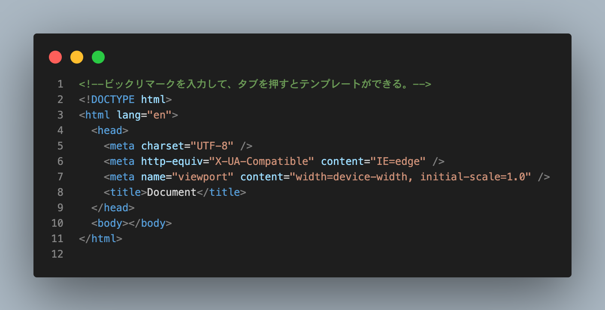
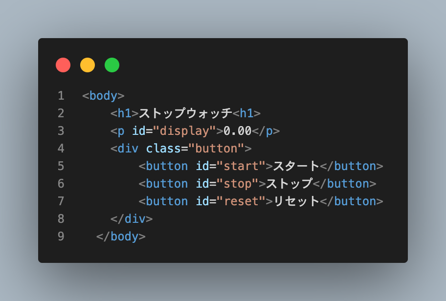
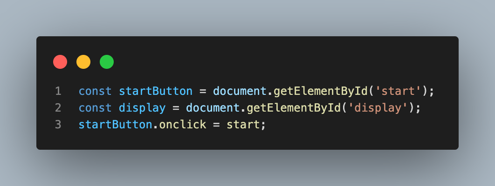
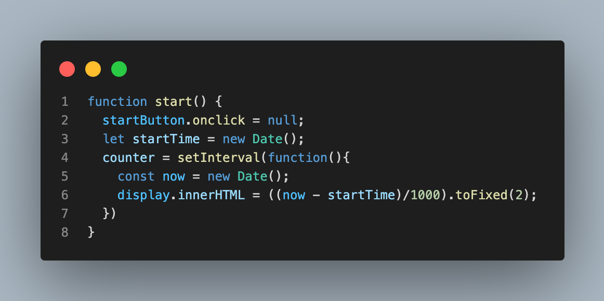
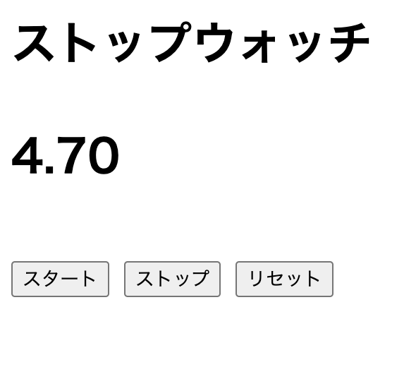
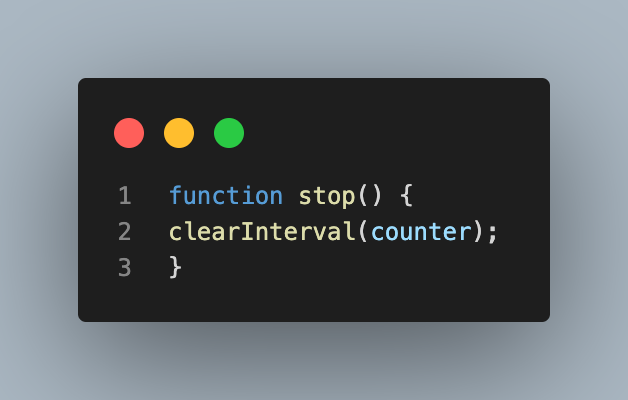
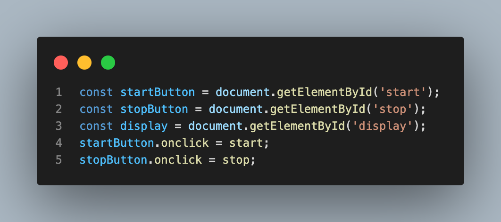

# ストップウォッチ作成体験会
presented by Lumos

---
## ツールのインストール
* https://jsfiddle.net/vhL283za/46/

* Google Chrome
(https://www.google.com/intl/ja/chrome/)
* Visual Studio Code
(https://code.visualstudio.com/download)

---
## 作業フォルダの作成
自分の使いやすい場所に、作業用のフォルダを作ってください。
名前はstop-watchにしましょう。

---
## HTMLファイルの作成
* VScodeで新しいファイルを作成
* cmd+S/ctr+Sで、ファイル名をindex.htmlに。
* !入力後、tabキーを押してテンプレートを作成

---
すると...

こんな感じに。

---
## 言語の説明
* HTML:Webサイトのレイアウトを設定する言語。家だと骨組みや間取り、部屋数などを決める大工に相当する。
* CSS:Webサイトのデザインを設定する言語。家だと、部屋や家具の配置や色などのデザインを決めるインテリアデザイナーに相当する。
* JS:Webサイトにおいて、計算などの処理を設定する言語。電気配線や水道などを設置する配線工などに相当する。

---
## htmlを書いてみよう
以下のように、htmlファイルはタグを使って文章を記述していきます。実際に書いてブラウザに表示されるか確認しましょう。
* &lt;p&gt;こんにちは。&lt;/p&gt;
* &lt;button&gt;押してね&lt;/button&gt;
* &lt;h1&gt;大見出しだよ&lt;/h1&gt;

---
## ボタンとディスプレイを設置しよう
ストップウォッチに必要になる要素を設置していきましょう。
* タイトル
* 秒数が映るディスプレイ
* スタート/ストップ/リセットボタン

---
## タグにidをつけよう
* pタグにはid='display'
* スタートボタンにはid='start'
* ストップボタンにはid='stop'
* リセットボタンにはid='reset'

---
完成形

---
## JavaScriptを使ってみよう
* const now = new Date();
* console.log(now.toString())
* 関数の書き方
function 関数名(){処理}
例：function plus(a,b) {console.log(a+b);}
* setInterval([関数],[ミリ秒数])

---
## やりたいことを考えてみよう
* スタートボタンを押したらカウントが始まる。
* ストップボタンを押したらカウントが止まる。
* リセットボタンを押したら0.00になる。

---
##　下準備をしよう
* window.onload() // ページが読み込まれた時に、()内の処理を実行する。
これから書くコードは全てこの()内に記述します。
* 引数、定数の定義をしよう

---
## カウンターを作ろう

1. let startTime = new Date(); //開始時刻を記録
1. counter = setInterval(function(){
    const now = new Date();
    display.innerHTML = ((now - startTime)/1000).toFixed(2)
}, 20); //現在時刻と開始時刻の差をdisplayに反映

---
## start()関数を作ろう。
スタート関数はスタートボタンが押された時に起動し、カウントの開始とスタートボタンの無効化を担う。

---
## スタートボタンを押してみよう
うまくいけばこのようになります。

---
## ストップボタンを作ろう

* ストップボタンを取得する
const stopButton = document.getElemtById('stop')
* ストップボタンを押すと呼び出される関数を設定
stopButton.onclick = stop;
* setInterval関数を止めるときは、clearInterval関数を使用。
function stop(){
    clearInterval(counter);
}

---
## ストップボタンを作ろう
定義はこのような感じ。

---
## ストップボタンを作ろう
stop関数はこのような感じ

---
## リセットボタンを作ろう
* リセットボタンを取得
const resetButton = document.etElementById("reset");
* リセットボタンを押すと呼び出される関数を設定
resetButton.onclick = reset;
* displayの表示をゼロに戻そう
dsiplay.innerHTML = "0.00"

---
## 仮完成！！
おめでとうございます！！
これで、ストップウォッチの最低限の機能は作れました。
バグや機能は不足がたくさんあるので、是非ご自身で勉強して完成させてみてください！！
Lumosに仮入会してくださる方は、一緒に最後まで作ってみませんか？